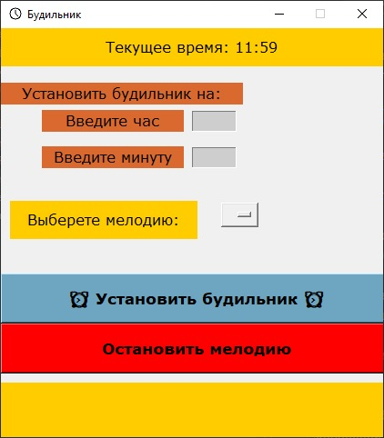

## Генератор паролей

Будильник с поддержкой своих mp3 мелодий. Необходимо в корневой папке
наличие папки alarms, куда можно копировать свои мелодии будильника.



## Установка

### Скачать

Python3 должен быть уже установлен.
[Скачать](https://github.com/Araime/Password-Generator/archive/master.zip) этот 
репозиторий себе на компьютер.

Рекомендуется использовать [virtualenv/venv](https://docs.python.org/3/library/venv.html)
для изоляции проекта.

#### Быстрая настройка venv

Начиная с Python версии 3.3, виртуальное окружение идёт в комплекте в виде модуля
venv. Чтобы его установить и активировать нужно выполнить следующие действия в
командной строке:  

Указать скачанный репозиторий в качестве каталога.
```sh
cd C:\Users\ваш_пользователь\Downloads\папка_репозитория
```
Установить виртуальное окружение в выбранном каталоге.
```sh
Python -m venv env
```
В репозитории появится папка виртуального окружения env  

<a href="https://imgbb.com/"></a>

Активировать виртуальное окружение.
```sh
env\scripts\activate
```
Если всё сделано правильно, вы увидите в командной строке (env) слева от пути 
каталога.  

<a href="https://imgbb.com/"></a>

#### Установить зависимости

Используйте `pip` для установки 
зависимостей:

```sh
pip install -r requirements.txt
```

### Запуск

```sh
python alarm-clock.py
```

Выберите мелодию, время и поставьте будильник.

## Запуск на Windows 10/11 pro как exe-файл

### Подготовка

Установите библиотеку [pyinstaller](https://pypi.org/project/pyinstaller/).

```sh
pip install pyinstaller
```

### Создание exe-файла

```sh
pyinstaller -w -F --add-data "iconbit.ico;." -i "icon.ico" alarm-clock.py
```
После сборки exe-файла в корне репозитория создается папка dist, в которой будет
лежать готовое приложение.

## Цель проекта

Данный репозиторий создан с целью изучения возможности создания приложений
на Python с графическим интерфейсом и создания exe-файлов для Windows.
